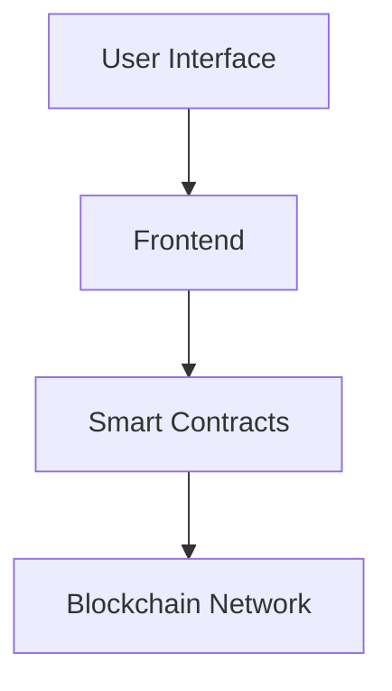

# Architecture Overview

```mermaid
flowchart TD
    A[User Interface] --> B[Frontend]
    B --> C[Smart Contracts]
    C --> D[Blockchain Network]
```

Detailed description of the blockchain layers, consensus mechanisms, and component interactions.
